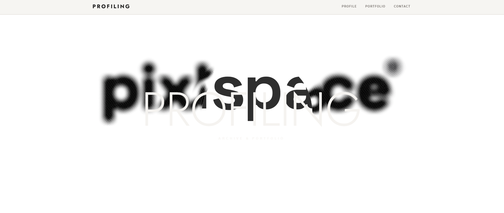
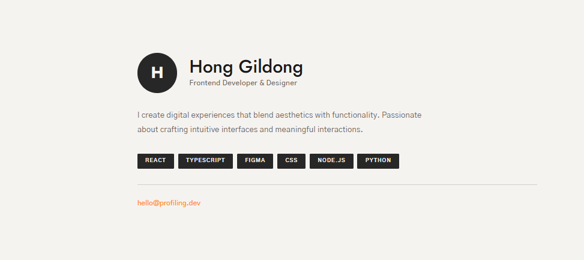
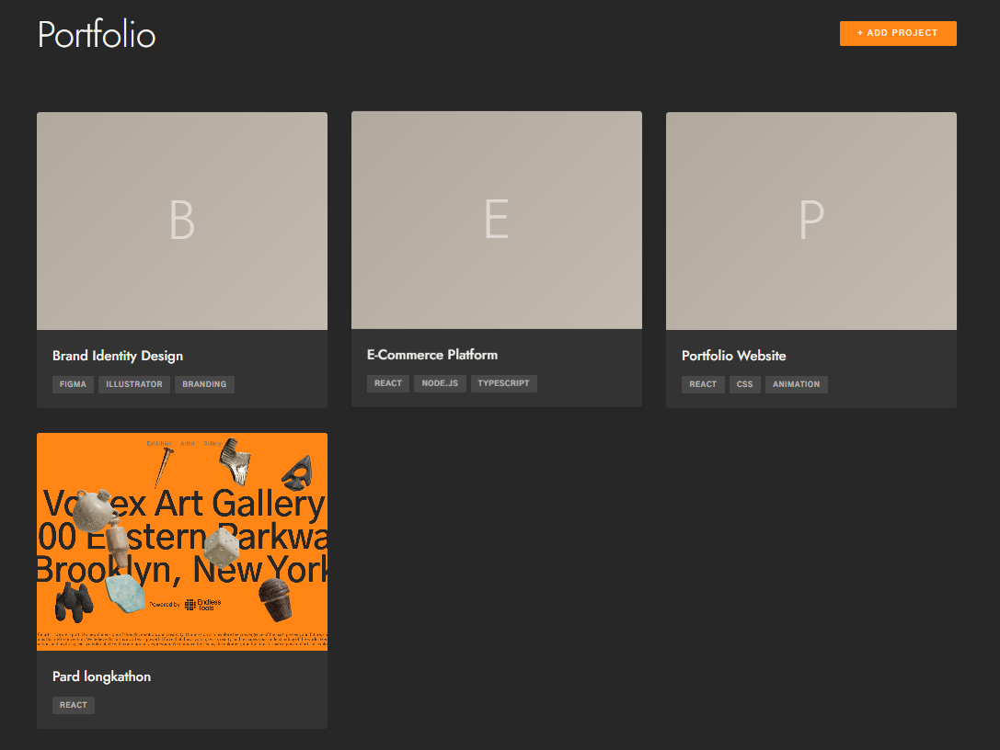
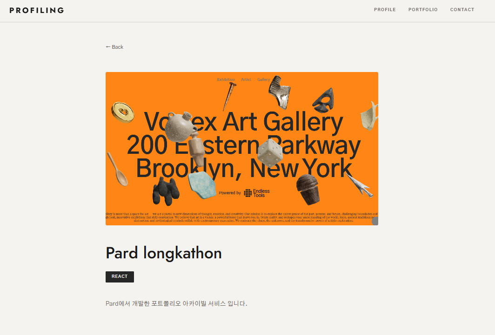

# PROFILING - 포트폴리오 아카이빙 사이트

개인 포트폴리오를 효과적으로 전시하고 관리할 수 있는 현대적인 포트폴리오 웹사이트입니다.
React, TypeScript, Vite를 사용하여 빠르고 반응형의 경험을 제공합니다.

## 🎯 프로젝트 개요

PROFILING은 개발자, 디자이너 등 전문가들이 자신의 작업물을 효과적으로 아카이빙하고 전시할 수 있는 플랫폼입니다.
직관적인 UI와 동적 애니메이션을 통해 전문성 있는 포트폴리오를 구성할 수 있습니다.

---

## 📑 주요 섹션

### 1. 🎬 Hero Section (메인 인트로 영역)

페이지 최상단의 임팩트 있는 첫 인상을 담당하는 섹션입니다.

**특징:**
- Spline 3D 애니메이션 통합으로 인터랙티브한 경험 제공
- "PROFILING - Archive & Portfolio" 주제 메시지 표시
- 반응형 레이아웃으로 모든 디바이스에서 최적화

**목적:**
방문자에게 브랜드 정체성을 표현하고 사이트의 목적을 빠르게 전달

---

### 2. 👤 Profile Section (프로필 영역)

사용자의 개인정보와 전문성을 소개하는 섹션입니다.

**포함 정보:**
- **프로필 이미지**: 사용자 이름의 첫 글자로 표현된 아바타
- **이름**: 전문가의 이름
- **역할**: 직책 또는 전문 분야 (예: "Frontend Developer")
- **소개글**: 프로필 바이오/자기소개
- **스킬 태그**: 보유 기술 스택을 태그 형식으로 표시
- **이메일 연락처**: 클릭 가능한 이메일 주소

**목적:**
방문자가 포트폴리오 소유자의 경력과 능력을 한눈에 파악할 수 있도록 함

---

### 3. 💼 Portfolio Section (포트폴리오 영역)

완성된 프로젝트들을 그리드 형태로 전시하는 섹션입니다.

**기능:**
- **프로젝트 카드**: 각 프로젝트의 요약 정보를 카드 형식으로 표시
- **프로젝트 추가**: "+ Add Project" 버튼으로 새로운 프로젝트 추가
- **그리드 레이아웃**: 반응형 그리드로 여러 프로젝트 한 화면에 표시
- **빈 상태 메시지**: 프로젝트가 없을 경우 가이드 메시지 표시

**포트폴리오 카드 정보:**
- 프로젝트 제목
- 프로젝트 설명
- 사용 기술/스택
- 프로젝트 링크 및 상세 정보

**목적:**
포트폴리오 소유자의 작업물을 구조적으로 전시하고 방문자의 관심사에 맞는 프로젝트를 쉽게 찾을 수 있도록 함

---

### 4. ✉️ Contact Section (연락처 영역)

프로필 섹션 내에 포함된 연락처 영역입니다.

**포함 정보:**
- **이메일**: 클릭 시 기본 메일 클라이언트로 연결
- **다양한 연락처 옵션** (확장 가능):
  - 소셜 미디어 링크
  - 전화번호
  - 메시지 앱 등

**목적:**
방문자가 포트폴리오 소유자와 쉽게 연락할 수 있는 명확한 경로 제공

---

### 5. 🔗 Navigation Header (네비게이션)

페이지 상단에 고정된 네비게이션 헤더입니다.

**구성 요소:**
- **로고**: "PROFILING" 브랜드명 (홈으로 이동 링크)
- **네비게이션 메뉴**:
  - Profile: 프로필 섹션으로 스크롤
  - Portfolio: 포트폴리오 섹션으로 스크롤
  - Contact: 연락처 섹션으로 스크롤

**목적:**
사용자가 페이지 어느 위치에서든 각 섹션으로 쉽게 이동할 수 있도록 함

---

### 6. 🔚 Footer (하단)

페이지 최하단의 브랜딩 및 저작권 정보 섹션입니다.

**포함 정보:**
- **브랜드명**: "PROFILING"
- **저작권**: "© 2025"

**목적:**
페이지의 브랜드 일관성을 유지하고 저작권 정보를 표시

---

## 🛠️ 기술 스택

| 구분 | 기술 |
|------|------|
| **프레임워크** | React |
| **언어** | TypeScript |
| **빌드 도구** | Vite |
| **라우팅** | React Router |
| **3D 애니메이션** | Spline |

---

## 🚀 주요 기능

- ✅ 반응형 디자인 (모바일, 태블릿, 데스크톱)
- ✅ 인터랙티브 3D 애니메이션 (Spline 통합)
- ✅ 프로젝트 동적 추가/관리
- ✅ 개인정보 및 스킬 커스터마이징
- ✅ 빠른 성능 (Vite 최적화)
- ✅ 타입 안정성 (TypeScript)

---

## 📸 상세 화면

프로젝트를 클릭하면 상세 정보를 확인할 수 있는 페이지로 이동합니다.

---

## 📱 사용 시나리오

1. **개발자/디자이너 포트폴리오**: 자신의 작업물 전시
2. **취업/이직 자료**: 이력서 대체 또는 보완 자료로 활용
3. **클라이언트 미팅**: 진행 중인 프로젝트 공유
4. **개인 브랜딩**: 전문성 있는 온라인 이미지 구축
